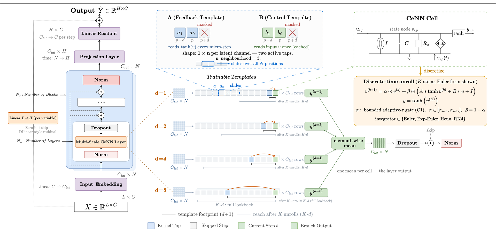

# AMS-CeNN — Adaptive Multi-Scale Cellular Neural Network

[](https://pypi.org/project/cenn-forecasting/)
[](LICENSE)
[](#installation)

A recurrent, dynamical-systems forecaster for **multivariate long-horizon time series forecasting**, built on a Cellular Neural Network (CeNN) substrate and integrated into [Nixtla NeuralForecast](https://github.com/Nixtla/neuralforecast).

AMS-CeNN combines three components:

- **C1 — Input-adaptive bounded integration gate.** A learned, per-channel gate that replaces the classical fixed integration scalar. Its output is bounded by construction, giving a **provable per-step contraction guarantee** — stability by construction, at no measurable accuracy cost.
- **C2 — Multi-scale dilation ensemble.** Parallel CeNN branches at dilations {1, 2, 4, 8} that capture temporal structure across multiple resolutions in a single forward pass.
- **Zero-initialized linear skip.** A DLinear-style residual initialized to zero, so the model begins as a pure CeNN and can fall back to a near-linear forecast on linearly dominated series — degrading gracefully rather than catastrophically.

<p align="center">
  
</p>

## Results

Evaluated across **seven standard multivariate LTSF benchmarks** (ETT, Weather, Electricity, Traffic) at horizons {96, 192, 336, 720}, under a uniform protocol (lookback `L = 512`; Friedman + Nemenyi over `N = 28` dataset–horizon blocks):

- **Accuracy** — ranks **4th of 12** methods (mean rank 5.21), within the critical-difference clique of the leader (statistically indistinguishable from the top-ranked method).
- **Robustness** — attains the **lowest worst-case relative error of all 12 evaluated models** (within ≈ 7 % of the best method on every dataset), with no catastrophic failures.
- **Footprint** — parameter-light (≈ 106 K parameters) and fast (≈ 1.7 ms per forecast).
- **Stability** — the learned gate and spectral margins are directly readable from the trained parameters; the bounded gate keeps the per-step map contractive and the spectral cap never binds in practice.

## Installation

```bash
pip install cenn-forecasting
```

Or from source — this repository is a fork of NeuralForecast v3.1.9 with AMS-CeNN integrated:

```bash
git clone https://github.com/mohamedelbahnasawi/ams-cenn
cd ams-cenn
pip install -e .
```

## Quickstart

```python
import pandas as pd
from neuralforecast import NeuralForecast
from neuralforecast.models import CeNN

# Headline AMS-CeNN configuration (variant C1C2-Skip-K2)
model = CeNN(
    h=96,                                  # forecast horizon
    input_size=512,                        # lookback window
    n_series=7,                            # number of series / channels
    hidden_dim=64,
    K=2,                                   # forward-Euler integration steps
    adaptive_tau=True,                     # C1: input-adaptive bounded gate
    multiscale_mode="parallel_ensemble",   # C2: parallel dilation ensemble {1, 2, 4, 8}
    linear_skip=True,                      # zero-initialized linear residual
    alpha_min=0.5, alpha_max=0.99,         # bounded gate -> per-step contraction
    spectral_cap=True, spectral_rho=0.9,
)

nf = NeuralForecast(models=[model], freq="h")
nf.fit(df)                                 # df with columns [unique_id, ds, y]
forecasts = nf.predict()
```

See [`experiments/config.py`](experiments/config.py) and [`experiments/runner.py`](experiments/runner.py) for the exact configuration of every variant used in the paper.

## Reproducing the paper

The full experiment suite (model + all baselines, atomic per-`(model, dataset, horizon, seed)` results, tables, and figures) is driven by the `experiments/` package:

```bash
# Run the headline model across the benchmark (5 seeds)
python -m experiments.runner --models C1C2-Skip-K2 \
    --datasets ETTh1 ETTh2 ETTm1 ETTm2 Weather Electricity Traffic \
    --horizons 96 192 336 720 --seeds 1 42 123 7 2026

# Aggregate results into tables + figures
python experiments/aggregate.py
python experiments/generate_paper_assets.py
```

Each run writes one JSON per `(model, dataset, horizon, seed)` under `experiments/results/` (skip-if-exists, so campaigns are resumable).

## Citation

If you use AMS-CeNN, please cite:

```bibtex
@article{elbahnasawi2026amscenn,
  title   = {Robust Long-Horizon Time Series Forecasting with Adaptive Multi-Scale Cellular Neural Networks},
  author  = {El Bahnasawi, Mohamed and Zekaj, Jonida and Dubatouka, Palina and Gebser, Martin and Kyamakya, Kyandoghere},
  year    = {2026}
}
```

> Citation details will be finalized upon publication.

## Acknowledgments

AMS-CeNN is built on [Nixtla NeuralForecast](https://github.com/Nixtla/neuralforecast) (v3.1.9) and preserves its Apache-2.0 license. See [`LICENSE`](LICENSE) and [`THIRD_PARTY_LICENSES.md`](THIRD_PARTY_LICENSES.md).
