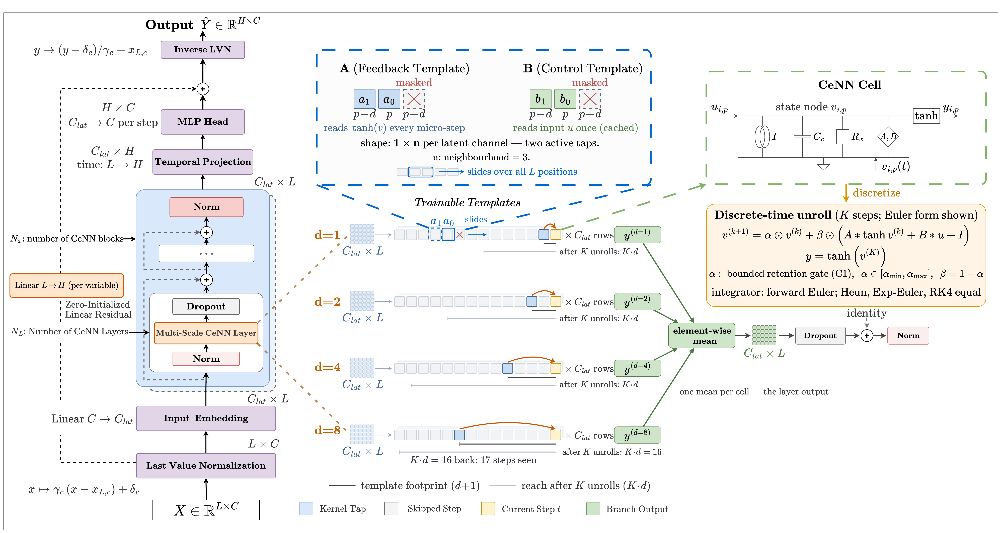

# AMS-CeNN — Auditable Multi-Scale Cellular Neural Network

[](https://doi.org/10.5281/zenodo.21041026)
[](LICENSE)
[](#installation)

A recurrent, dynamical-systems forecaster for **multivariate long-horizon time series forecasting**, built on a Cellular Neural Network (CeNN) substrate and integrated into [Nixtla NeuralForecast](https://github.com/Nixtla/neuralforecast).

AMS-CeNN is a **parameter-auditable nonlinear residual forecaster with a stability-certified cellular recurrence**: a bounded cellular recurrent module adds controlled nonlinear dynamics around a strong full-lookback linear forecasting path, which is the primary accuracy driver. Every window is normalized inside the model to its last observed value (last-value normalization, LVN: an NLinear-style, per-channel, invertible transform), so no pipeline scaler is applied. It combines three components:

- **C1 — Bounded, stability-certified integration gate.** A learned, per-channel gate whose output is bounded by construction, giving a **provable per-step contraction guarantee** on the cellular hidden-state recurrence (a local guarantee, not a full-network one) at no measurable accuracy cost. The learned gate converges to a near-uniform regime: its value is the certified stability and auditability it provides, not input adaptation.
- **C2 — Multi-scale dilation ensemble.** Parallel CeNN branches at dilations {1, 2, 4, 8} that provide multi-resolution nonlinear refinement in a single forward pass.
- **Zero-initialized linear residual on the last-value-normalized window.** A full-lookback linear map on the LVN window, initialized to zero, so the model begins as a pure CeNN and can fall back to a near-linear forecast on linearly dominated series. Ablations show this residual carries the accuracy: on its own it reaches mean rank 3.75 of 12, and the cellular pathway on top of it is accuracy-neutral. LVN also confines a dead input channel to that channel (healthy-channel error ratio 0.999 under a stuck sensor).

<p align="center">
  
</p>

## Results

Evaluated across **seven standard multivariate LTSF benchmarks** (ETT, Weather, Electricity, Traffic) at horizons {96, 192, 336, 720}, under a uniform protocol (lookback `L = 512`; Friedman + Nemenyi over `N = 28` dataset–horizon blocks):

- **Accuracy** — ranks **1st of 12** methods (Friedman mean rank 3.14; PatchTST 4.54, TSMixer 4.61 and DLinear 4.93 lie inside the Nemenyi critical difference of 3.15, the other eight are significantly worse) and is non-inferior to every baseline at a pre-registered 2 % margin. The ranking gain over the earlier min-max configuration (4th, mean rank 5.21, kept as an ablation row) is carried by the linear residual on the LVN window, not by the cellular pathway.
- **Robustness** — attains the **lowest worst-case relative error of all 12 evaluated models** (within 6.3 % of the best method on every dataset), degrades less than the baseline median under additive noise, outliers and missing blocks, and confines a dead sensor to its own channel; it degrades more than the median under gain errors and level shifts, and is not claimed robust to gross distribution shift.
- **Auditability** — the learned gate retention and feedback operator norms are directly readable from the trained parameters and tied to the contraction guarantee; the spectral cap binds in one of 8,960 audited branch-channel pairs across the 35 audited cells.
- **Footprint** — parameter-light (106,197 parameters at ETTh1, H = 96; 5.3 M multiply-accumulates; 4.65 ms per multivariate forecast on an RTX 4090). Its multiply-accumulate count and latency exceed the linear baselines, so the model is not positioned as compute-efficient.

## Installation

This repository is a fork of NeuralForecast v3.1.9 with AMS-CeNN integrated; install it from source:

```bash
git clone https://github.com/mohamedelbahnasawi/ams-cenn
cd ams-cenn
pip install -e .
```

The `cenn-forecasting` package on PyPI is the standalone conference-era CeNN forecaster (the `cenn/` directory of this repository); it does **not** contain the AMS-CeNN configuration evaluated in the paper, which lives in `neuralforecast/cenn/` and is used through the NeuralForecast `CeNN` model below.

## Quickstart

```python
import pandas as pd
from neuralforecast import NeuralForecast
from neuralforecast.models import CeNN

# Headline AMS-CeNN configuration (variant AMS-Anc)
model = CeNN(
    h=96,                                  # forecast horizon
    input_size=512,                        # lookback window
    n_series=7,                            # number of series / channels
    hidden_dim=64, N=1, neighborhood=3,    # cell width, cells per channel, template radius
    num_layers=4, dropout=0.25,            # four dilation branches in the ensemble
    K=2,                                   # forward-Euler integration steps
    adaptive_tau=True,                     # C1: bounded, input-conditioned gate (stability mechanism)
    multiscale_mode="parallel_ensemble",   # C2: parallel dilation ensemble {1, 2, 4, 8}
    linear_skip=True,                      # zero-initialized linear residual
    revin=True, revin_mode="last_only",    # in-model last-value normalization (LVN) + per-channel affine
    scaler_type="identity",                # no pipeline scaler
    alpha_min=0.5, alpha_max=0.99,         # bounded gate -> per-step contraction
    spectral_cap=True, spectral_rho=0.9,
)

# -> 106,197 parameters for n_series=7, h=96 (the ETTh1 profile in the paper)
nf = NeuralForecast(models=[model], freq="h")
nf.fit(df)                                 # df with columns [unique_id, ds, y]
forecasts = nf.predict()
```

See [`experiments/config.py`](experiments/config.py) and [`experiments/runner.py`](experiments/runner.py) for the exact configuration of every variant used in the paper.

## Reproducing the paper

The full experiment suite (model + all baselines, atomic per-`(model, dataset, horizon, seed)` results, tables, and figures) is driven by the `experiments/` package. See [`experiments/REPRODUCE.md`](experiments/REPRODUCE.md) for the complete protocol and a result→figure/table mapping.

```bash
# Run the headline model across the benchmark (5 seeds)
python -m experiments.runner --models CeNN_AMS-Anc \
    --datasets ETTh1 ETTh2 ETTm1 ETTm2 Weather Electricity Traffic \
    --horizons 96 192 336 720 --seeds 1 42 123 7 2026

# Regenerate every table and figure from the result JSONs (no retraining)
bash experiments/regenerate_all.sh
```

Each run writes one JSON per `(model, dataset, horizon, seed)` under `experiments/results/` (skip-if-exists, so campaigns are resumable). **The per-seed result JSONs of every run reported in the paper are included in this repository** (`experiments/results/`, `experiments/efficiency/`, `experiments/_robustness/`), so every table and figure can be regenerated without retraining. The robustness, gate-variation, cross-channel, and receptive-field studies are driven by `experiments/run_robustness.py`, `experiments/run_gate_probe.py`, and the scripts under `experiments/analysis/`.

## Citation

If you use AMS-CeNN, please cite:

```bibtex
@article{elbahnasawi2026amscenn,
  title   = {{AMS-CeNN}: An Auditable, Stability-Certified Cellular Residual Network for Robust Long-Horizon Engineering Forecasting},
  author  = {El Bahnasawi, Mohamed and Zekaj, Jonida and Dubatouka, Palina and Gebser, Martin and Kyamakya, Kyandoghere},
  year    = {2026}
}
```

Software archive (all versions): [doi:10.5281/zenodo.21041026](https://doi.org/10.5281/zenodo.21041026). Citation details will be finalized upon publication.

## Acknowledgments

AMS-CeNN is built on [Nixtla NeuralForecast](https://github.com/Nixtla/neuralforecast) (v3.1.9) and preserves its Apache-2.0 license. See [`LICENSE`](LICENSE) and [`THIRD_PARTY_LICENSES.md`](THIRD_PARTY_LICENSES.md).
